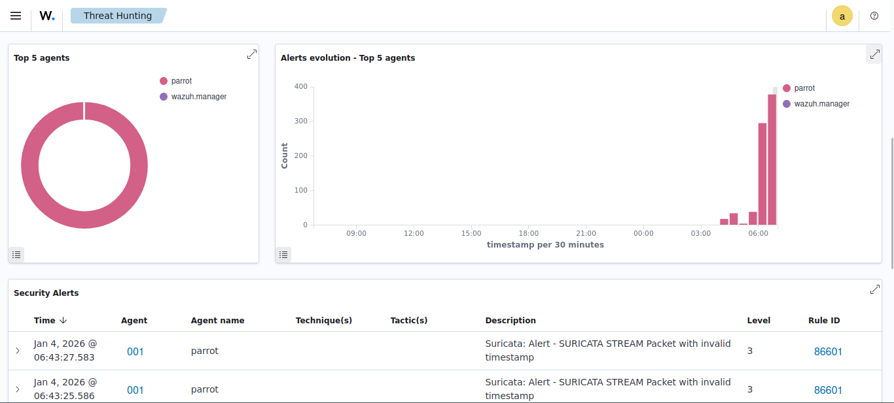

# 🛡️ Portafolio SecOps: Automatización de Seguridad con Wazuh y n8n

## 📋 Descripción del Proyecto
Este proyecto implementa un entorno de **Security Orchestration, Automation, and Response (SOAR)** utilizando Docker. El objetivo es orquestar la seguridad defensiva mediante la integración de **Wazuh (SIEM)** y **n8n (Workflow Automation)**.

## 🚀 Hitos Alcanzados (Fase 1)
- **Despliegue de Infraestructura:** Implementación de Wazuh Manager, Indexer y Dashboard mediante Docker Compose.
- **Gestión de Identidad (IAM):** Recuperación y endurecimiento de credenciales API (RBAC) en entorno contenedorizado.
- **Automatización de Autenticación:** Desarrollo de un flujo en n8n para la gestión rotativa de Tokens JWT.
- **Conectividad Interna:** Configuración de networking seguro en Docker () para comunicación API Server-to-Server.

## 🛠️ Stack Tecnológico
- **OS:** Parrot Security OS
- **SIEM:** Wazuh 4.7.2
- **Orquestación:** n8n (Dockerized)
- **Contenerización:** Docker & Docker Compose
- **Scripting:** Python & Bash

## 📂 Estructura del Repositorio
- `docker-compose.yml`: Definición de la infraestructura como código (IaC).
- `workflows/`: Flujos de automatización de n8n (JSON).

## 🚀 Hitos Alcanzados (Fase 2)
- **Despliegue de Agente (Endpoint):** Instalación y configuración de Wazuh Agent en Parrot Security OS.
- **Troubleshooting Avanzado:** Resolución de conflictos de dependencias (DPKG), alineación de versiones (APT Pinning) y gestión de identidades duplicadas.
- **Conexión SIEM:** Establecimiento de canal seguro TCP/1514 entre el Host y el Manager Dockerizado.
- **[📄 Ver Reporte Técnico Detallado de Fase 2](documentation/phase2/REPORT.md)**

## 🌐 Fase 3: Seguridad de Red (NIDS con Suricata)

Se ha implementado una capa de seguridad perimetral utilizando **Suricata** como Sistema de Detección de Intrusos en Red (NIDS).

### 🛡️ Arquitectura de Red
* **Motor NIDS:** Suricata instalado en el host (Parrot OS) escuchando en modo promiscuo sobre la interfaz de red principal.
* **Integración:** El Agente Wazuh lee el archivo `eve.json` de Suricata en tiempo real.
* **Correlación:** El Manager decodifica los eventos JSON y genera alertas de seguridad basadas en reglas de amenazas emergentes (ET Open Rules).

### 📸 Evidencia de Detección
Prueba de concepto realizada simulando una respuesta de comando malicioso (`uid=0(root)`). Suricata inspeccionó el paquete, detectó la firma y Wazuh generó la alerta de nivel alto.



### ⚙️ Configuración Realizada
1.  Instalación de Suricata y actualización de reglas (47,000+ firmas).
2.  Configuración de escucha en interfaz `wlp4s0`.
3.  Modificación de `ossec.conf` en el agente para ingestión de logs:
    ```xml
    <localfile>
      <log_format>json</log_format>
      <location>/var/log/suricata/eve.json</location>
    </localfile>
    ```

---
*Proyecto Finalizado - Infraestructura SecOps 100% Operativa.*
